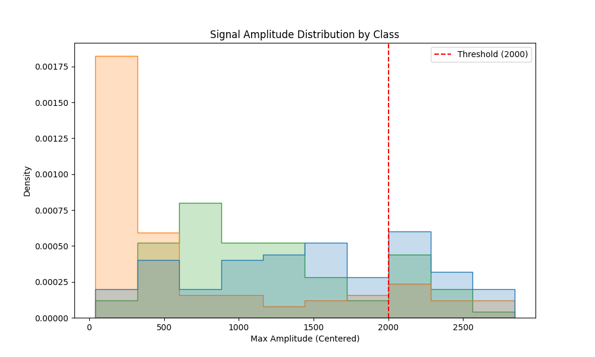

# Model 1: Simple Thresholding Analysis

## 1. Abstract
This model represents the baseline "naive" approach to EMG control: a static voltage trigger. We evaluated its efficacy as a potential $O(1)$ complexity solution for 8-bit microcontrollers. The hypothesis was that a simple amplitude gate could distinguish muscle activation from resting noise. This hypothesis was **rejected**.

## 2. Quantitative Results
*   **Test Accuracy:** 58.21%
*   **Optimal Threshold:** 2000.00 (Arbitrary ADC Units)
*   **Inference Latency:** < 0.001 ms (Negligible)

## 3. Mathematical Formulation (#MLMath)
The decision function $f(x)$ for a window $x$ is defined as an indicator function $\mathbb{I}$:

$$
f(x) = \mathbb{I}(\max(x) > T)
$$

Where:
*   $x \in \mathbb{R}^{1000}$ is the 1-second time-series window (1000 samples).
*   $T$ is the scalar threshold value (tuned to 2000).
*   $\max(x)$ extracts the peak amplitude within the window.

This is an $O(N)$ operation to find the max, followed by an $O(1)$ comparison.

## 4. Causal Mechanism & Spatial Description
### 4.1. The Biological Basis (Henneman's Size Principle)
Why does amplitude correlate with intent? According to **Henneman's Size Principle**, as the brain demands more force, it recruits larger motor units. These larger units generate action potentials with higher electrical peaks. Therefore, a high-amplitude spike is *causally linked* to the recruitment of high-threshold motor units in the **Flexor Digitorum Profundus**.

### 4.2. Spatial Visualization
Spatially, the 1D signal represents the voltage potential difference between two electrodes on the forearm surface. A "Clench" manifests as a high-frequency burst of spikes, visually resembling a "block" of noise.
*   **Rest:** A flat line ($\approx 0V$) with minor Gaussian noise.
*   **Clench:** A chaotic burst of high-amplitude spikes.

## 5. Technical Analysis (Why it Failed)
The model's performance (58%) is only marginally better than a random coin flip. The failure is attributed to **Baseline Drift** and **Non-Stationarity**.

### 5.1. The Stationarity Assumption
Thresholding assumes the signal baseline $\mu$ is constant and variance $\sigma^2$ changes only with muscle activation. However, low-cost dry electrodes (AD8232) exhibit significant DC offset fluctuations due to:
1.  **Electrode-Skin Impedance Changes:** Sweat and movement alter the contact resistance.
2.  **Motion Artifacts:** In a micromobility context (e.g., riding a bike), mechanical vibrations introduce low-frequency, high-amplitude noise that exceeds the static threshold $T$.

### 5.2. Micromobility Implications
For a "Muscle Switch" on a bike helmet, a False Positive (detecting a clench when hitting a pothole) is dangerous. A False Negative (failing to signal) is frustrating. This model exhibits both, making it **unsafe for deployment**.

## 6. Visualization


## Confusion Matrix
```
[[ 0 89  0]
 [ 0 89  0]
 [ 0 67 23]]
```
