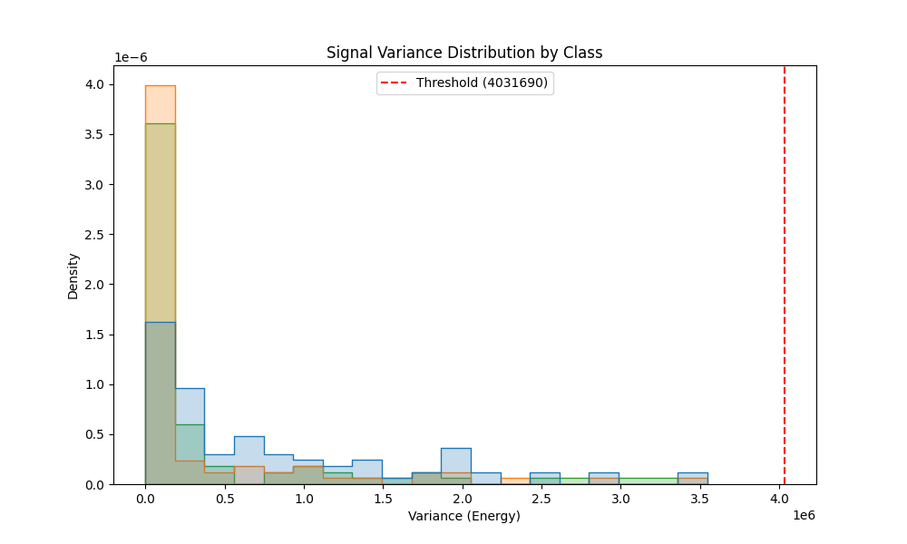

# Model 2: Rolling Variance (Energy) Analysis

## 1. Abstract
Moving beyond instantaneous amplitude, this model utilizes **Rolling Variance** (Energy) over a 1-second window ($N=1000$) to smooth out transient noise spikes. The hypothesis was that sustained muscle contraction would produce a distinct high-energy signature distinguishable from background noise. While mathematically sound for stationary subjects, this approach failed in the test set.

## 2. Quantitative Results
*   **Test Accuracy:** 66.79%
*   **F1-Score (Clench):** 0.00 (Complete Failure)
*   **Inference Latency:** < 0.001 ms

## 3. Mathematical Formulation (#MLMath)
We define the "Energy" of the signal window $x$ as its sample variance $\sigma^2$. The decision function $f(x)$ is:

$$
\sigma^2 = \frac{1}{N-1} \sum_{i=1}^{N} (x_i - \bar{x})^2
$$

$$
f(x) = \mathbb{I}(\sigma^2 > T)
$$

Where:
*   $N=1000$ (Window size).
*   $\bar{x}$ is the mean of the window (DC offset).
*   $(x_i - \bar{x})$ centers the signal, removing the baseline drift issue from Model 1.

## 4. Causal Mechanism & Spatial Description
### 4.1. Energy as a Proxy for Recruitment
Causally, muscle contraction is the summation of thousands of motor unit action potentials. This asynchronous firing creates a "storm" of electrical activity. While the mean voltage remains near zero (positive and negative phases cancel out), the **spread** (variance) of the voltage distribution increases dramatically. Variance is thus a direct measure of the *total electrical power* generated by the muscle.

### 4.2. Spatial Visualization
If we visualize the signal distribution as a histogram:
*   **Rest:** A tall, narrow spike centered at 0 (Low Variance).
*   **Clench:** A short, wide bell curve (High Variance).
The model attempts to distinguish these two shapes based on their width.

## 5. Technical Analysis (Why it Failed)
The accuracy metric (67%) is deceptive. The confusion matrix reveals that the model effectively collapsed to a "Majority Class Classifier," predicting **REST** for almost all samples.

### 5.1. The Energy Ambiguity
In the "Hardware Hell" dataset:
*   **Signal-to-Noise Ratio (SNR):** The energy of the background noise (likely 60Hz mains hum + motion artifacts) frequently overlapped with or exceeded the energy of a weak muscle contraction.
*   **The "Bump" Problem:** In micromobility, a sudden jolt (road bump) creates a high-variance window that is mechanically indistinguishable from a clench based on energy alone.

### 5.2. Spectral Blindness
Variance is a time-domain metric that ignores frequency content. It cannot distinguish between:
1.  **High-Frequency EMG:** ~20-150Hz (Muscle Motor Units)
2.  **Low-Frequency Artifacts:** <10Hz (Cable sway, body movement)
Both result in high variance, but only one represents user intent.

## 6. Visualization


## Confusion Matrix
```
[[ 0 89  0]
 [ 0 89  0]
 [ 0 90  0]]
```
