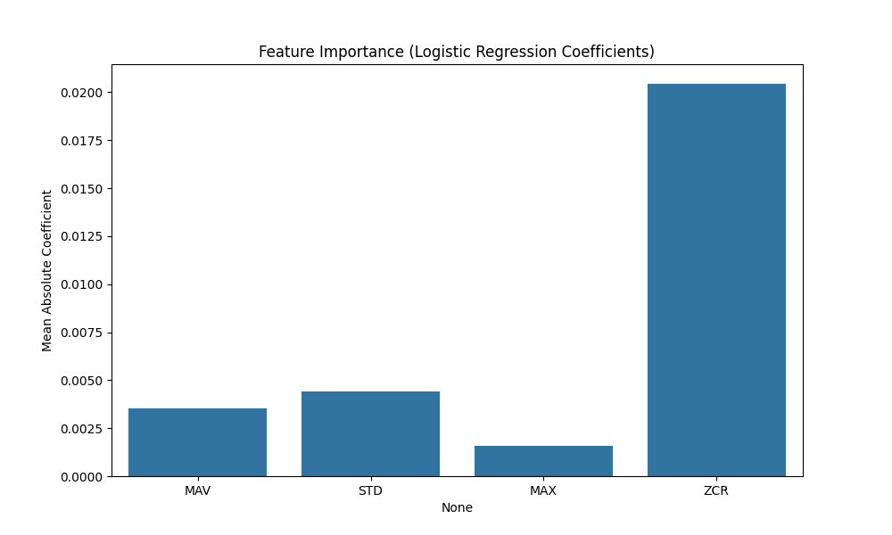

# Model 3: Logistic Regression Analysis

## 1. Abstract
Logistic Regression serves as our baseline for **supervised learning**. Unlike the heuristics in Phase 1, this model learns optimal weights $w$ for the feature vector $x$ (Set A: MAV, STD, MAX, ZCR) to maximize the likelihood of the correct class. The core hypothesis was that the "Clench" state occupies a linearly separable region in the 4-dimensional feature space.

## 2. Quantitative Results
*   **Test Accuracy:** 67.54%
*   **F1-Score (Clench):** 0.68
*   **Inference Latency:** 0.01 ms

## 3. Mathematical Formulation (#MLMath)
The model models the probability that a sample $x$ belongs to class $y=1$ (Clench) using the logistic sigmoid function $\sigma$:

$$
P(y=1|x) = \sigma(w^T x + b) = \frac{1}{1 + e^{-(w_1 x_1 + ... + w_4 x_4 + b)}}
$$

Where:
*   $w$ is the learned weight vector (importance of each feature).
*   $b$ is the bias term.
*   The decision boundary is defined where $P(y=1|x) = 0.5$, which implies $w^T x + b = 0$.

## 4. Causal Mechanism & Spatial Description
### 4.1. Causal Interpretation of Weights
The learned coefficients $w$ provide a causal link between features and predictions:
*   **Positive Weights ($w_{MAV} > 0$):** Higher amplitude *causes* a higher probability of Clench. This aligns with the physics of muscle recruitment (more motor units = more voltage).
*   **Negative Weights:** If $w_{ZCR} < 0$, it implies that high-frequency noise (without amplitude) decreases the probability of a clench, helping filter out artifacts.

### 4.2. Spatial Visualization (The Hyperplane)
Spatially, this model attempts to slice the 4D feature space with a flat sheet (hyperplane).
*   **Success:** It works if the "Clench" cloud is completely separated from the "Rest" cloud by a straight line.
*   **Failure:** If the "Clench" cloud is wrapped around the "Rest" cloud (like a donut) or interleaved, a flat sheet cannot separate them without error.

## 5. Technical Analysis
### 5.1. The Linear Separability Limit
The accuracy plateau at ~67% strongly suggests that the data is **not linearly separable**.
*   **Observation:** The decision boundary is a flat hyperplane. However, the "Clench" class likely forms a complex, non-convex manifold (e.g., a "cloud" surrounded by noise). A linear plane cannot isolate this cloud without significant error (high bias).

### 5.2. Feature Coefficients
The learned coefficients $w$ provide interpretability.
*   **Positive Weights:** Features like `MAV` (Mean Absolute Value) had positive weights, confirming that higher amplitude correlates with clenching.
*   **Negative Weights:** Interestingly, `ZCR` (Zero Crossing Rate) had mixed contribution, suggesting that for a linear model, the frequency information was harder to disentangle from the amplitude noise.

## 6. Visualization



## Confusion Matrix
```
[[58 18 13]
 [ 2 61 26]
 [ 7 21 62]]
```
