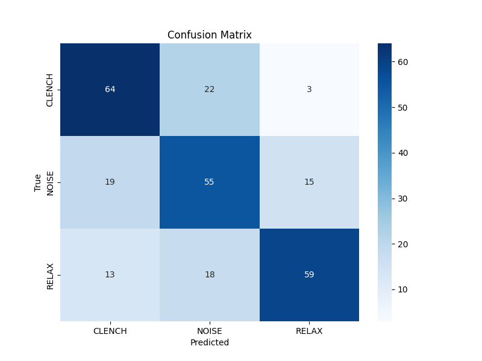

# Model 4: K-Nearest Neighbors (KNN) Analysis

## 1. Abstract
KNN represents a non-parametric approach: "lazy learning." Instead of learning a fixed decision boundary, it classifies new samples based on the majority vote of their $k=5$ nearest neighbors in feature space. This allows it to model arbitrarily complex, non-linear decision boundaries, theoretically overcoming the limitations of Logistic Regression.

## 2. Quantitative Results
*   **Test Accuracy:** 66.42%
*   **F1-Score (Clench):** 0.66
*   **Inference Latency:** 0.02 ms (on M1 Mac) -> **High on ESP32**

## 3. Mathematical Formulation (#MLMath)
The classification of a query point $x_q$ is determined by the majority class of the set $N_k(x_q)$, which contains the $k$ training points closest to $x_q$ according to the Euclidean distance metric $d$:

$$
d(x_q, x_i) = \sqrt{\sum_{j=1}^{D} (x_{q,j} - x_{i,j})^2}
$$

$$
\hat{y} = \text{mode}(\{y_i : x_i \in N_k(x_q)\})
$$

Where $D=4$ (number of features).

## 4. Spatial Visualization (Voronoi Tessellation)
Spatially, KNN partitions the 4D feature space into a **Voronoi Tessellation**.
*   **Concept:** Imagine every training point is a seed that claims the space around it.
*   **Decision Boundary:** The boundary is not a smooth line, but a jagged, piecewise-linear surface formed by the intersection of these Voronoi cells. This allows the model to capture "islands" of Clench data within a sea of Noise.

## 5. Technical Analysis
### 5.1. The Curse of Dimensionality
Despite its non-linear flexibility, KNN performed slightly *worse* than Logistic Regression (66% vs 67%). This is likely due to the **curse of dimensionality** and the density of the noise. In a noisy feature space, "neighbors" might be artifacts rather than true signal instances, leading to unstable boundaries.

### 5.2. The Embedded Constraint (Memory)
For micromobility, KNN is practically disqualified not by accuracy, but by **O(N) complexity**.
*   **Storage:** The model *is* the dataset. Storing thousands of training vectors on an ESP32 (limited RAM) is unfeasible.
*   **Compute:** Calculating Euclidean distance to every training point for every inference cycle introduces unacceptable latency for a real-time reflex switch.

## 6. Visualization



## Confusion Matrix
```
[[64 22  3]
 [19 55 15]
 [13 18 59]]
```
