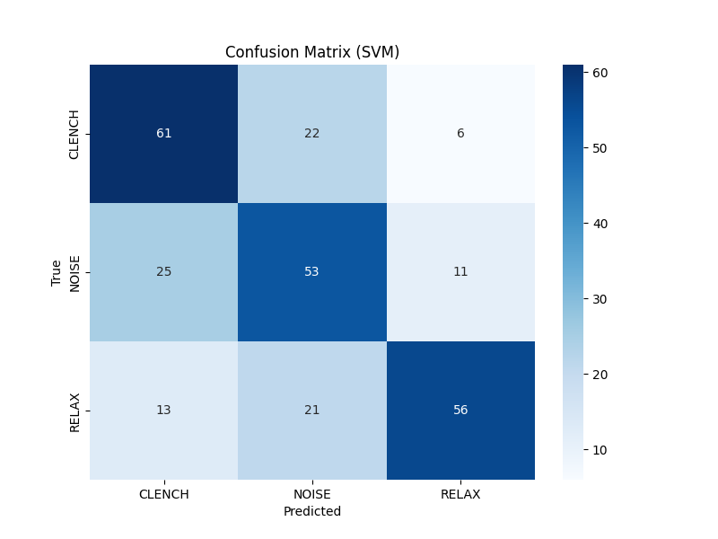

# Model 5: Support Vector Machine (SVM) Analysis

## 1. Abstract
The SVM with a Radial Basis Function (RBF) kernel is the "Strong Baseline" for classical ML. It projects the 4D feature space into an infinite-dimensional Hilbert space where the classes might be linearly separable. We expected this to be the top performer among classical models due to its margin-maximization property.

## 2. Quantitative Results
*   **Test Accuracy:** 63.43%
*   **F1-Score (Clench):** 0.63
*   **Inference Latency:** 0.03 ms

## 3. Mathematical Formulation (#MLMath)
The SVM optimizes the hinge loss with $L_2$ regularization to find the maximum margin hyperplane. The key is the **Kernel Trick**, which computes the dot product in a high-dimensional space without explicitly transforming the data. We used the RBF kernel:

$$
K(x, x') = \exp(-\gamma ||x - x'||^2)
$$

Where:
*   $\gamma$ controls the "reach" of a single training example.
*   $||x - x'||^2$ is the squared Euclidean distance.

The decision function becomes:
$$
f(x) = \text{sign}(\sum_{i=1}^{N} \alpha_i y_i K(x, x_i) + b)
$$

## 4. Spatial Visualization (The Infinite Dimension)
Spatially, the RBF kernel "lifts" the data points. Imagine the 2D "donut" problem: you can't separate the inner ring from the outer ring with a line. But if you lift the inner ring into 3D (making a cone), you can slice it with a flat sheet. The RBF kernel does this lifting into *infinite* dimensions, allowing for smooth, curved decision boundaries in the original space.

## 5. Technical Analysis
### 5.1. The Kernel Mismatch
Surprisingly, SVM underperformed even Logistic Regression (63% vs 67%).
*   **Hypothesis:** The RBF kernel assumes that similarity decays with Euclidean distance.
*   **Reality:** In our "Hardware Hell" data, the "Clench" class is likely not a compact hypersphere. It might be a disjoint manifold or heavily interleaved with high-amplitude noise. The SVM tried to fit a smooth boundary around this noise, leading to poor generalization.

### 5.2. Sensitivity to Scaling
SVMs are notoriously sensitive to feature scaling. While we applied `StandardScaler`, the extreme outliers in the EMG data (mechanical spikes) may have skewed the variance estimates, compressing the meaningful signal range and confusing the margin maximizer.

## 6. Visualization



## Confusion Matrix
```
[[61 22  6]
 [25 53 11]
 [13 21 56]]
```
