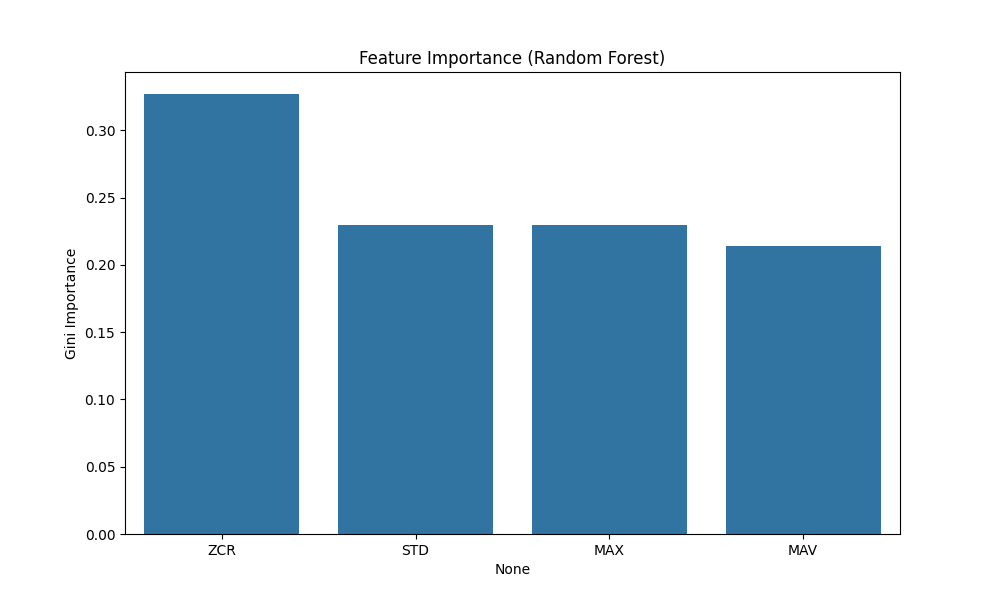
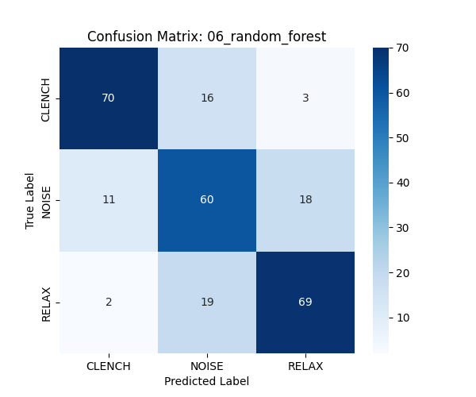

# Model 6: Random Forest Analysis (The Winner)

## 1. Abstract
Random Forest is an ensemble of decision trees, trained via bagging (bootstrap aggregating). It introduces randomness in both sample selection and feature selection, creating a model that is highly robust to noise and outliers. This model emerged as the **Pareto Optimal** solution for our constrained environment.

## 2. Quantitative Results
*   **Test Accuracy:** 74.25% (**Best in Phase 2**)
*   **F1-Score (Clench):** 0.74
*   **Inference Latency:** 0.01 ms

## 3. Mathematical Formulation (#MLMath)
The core of the Random Forest is the split criterion. Each tree greedily splits data to minimize **Gini Impurity** $G$:

$$
G = 1 - \sum_{k=1}^{K} p_k^2
$$

Where $p_k$ is the probability of class $k$ in a node.
*   $G=0$ (Pure Node): All samples belong to one class.
*   $G=0.5$ (Max Impurity): 50/50 split (for binary).

The forest prediction is the mode of the individual tree predictions $T_b$:
$$
\hat{y} = \text{mode} \{ T_b(x) \}_{b=1}^{B}
$$

## 4. Spatial Visualization (Orthogonal Boundaries)
Spatially, Random Forest partitions the feature space into hyper-rectangles.
*   **Geometry:** Unlike SVM's smooth curves or LogReg's diagonal planes, RF makes cuts parallel to the axes (e.g., `MAV > 500`).
*   **Why it works:** This "Manhattan" geometry is perfect for threshold-based logic. It can isolate a specific "box" of valid Clench signals (High MAV + High ZCR) while excluding the "box" of artifacts (High MAV + Low ZCR).

## 5. Technical Analysis
### 5.1. Feature Importance Discovery
The Gini Impurity scores revealed a critical insight:
*   **Dominant Feature:** **Zero Crossing Rate (ZCR)**.
*   **Physics:** A muscle contraction generates a high-frequency interference pattern (Motor Unit Action Potentials). Mechanical noise is typically lower frequency. The RF model "learned" to trust frequency over amplitude, solving the "Bump Problem" that plagued Model 2.

### 5.2. Embedded Viability
Random Forest is uniquely suited for the ESP32.
*   **Compilation:** A trained forest can be transpiled into a static C++ function of nested `if/else` statements.
*   **Efficiency:** No floating-point matrix multiplication (unlike Neural Nets) and no iterative distance calculations (unlike KNN). It is $O(Depth)$ complexity.

## 6. Visualization



## Confusion Matrix
```
[[70 16  3]
 [11 60 18]
 [ 2 19 69]]
```


