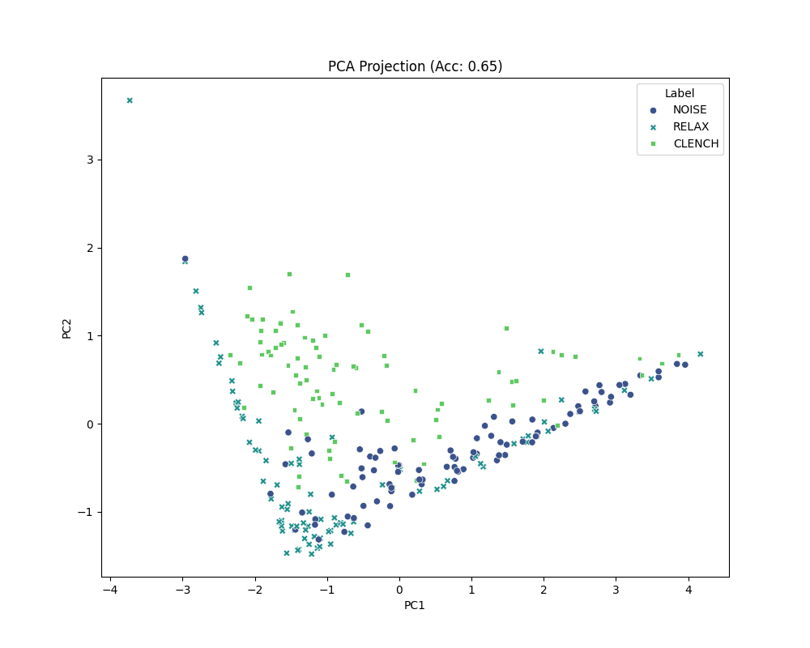
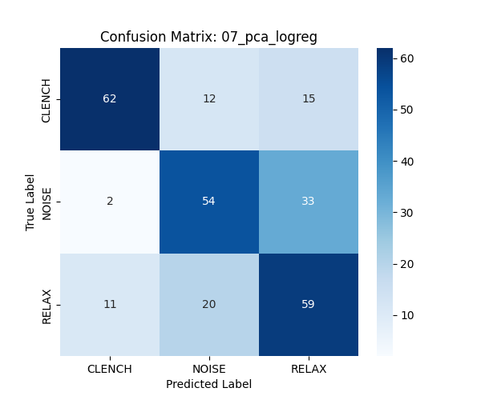

# Model 7: PCA + Logistic Regression Analysis

## 1. Abstract
Principal Component Analysis (PCA) was employed to test the hypothesis that the "Clench" signal resides on a lower-dimensional manifold within the 4D feature space. We projected the data onto the top 2 Principal Components and trained a Logistic Regression classifier. The goal was to visualize the decision boundary and potentially denoise the signal.

## 2. Quantitative Results
*   **Test Accuracy:** 65.30%
*   **Inference Latency:** 0.01 ms
*   **Explained Variance (2 Components):** ~85%

## 3. Mathematical Formulation (#MLMath)
PCA performs an eigendecomposition of the covariance matrix $\Sigma$ of the centered data $X$:

$$
\Sigma = \frac{1}{N} X^T X
$$

$$
\Sigma v_i = \lambda_i v_i
$$

Where $v_i$ are the eigenvectors (principal components) and $\lambda_i$ are the eigenvalues (variance explained). We project $x$ onto the subspace spanned by the top 2 eigenvectors $V_2$:
$$
x_{proj} = x V_2
$$

## 4. Spatial Visualization (The Shadow)
Spatially, PCA rotates the 4D hyper-cloud to align with its axes of maximum variance, then flattens it like a pancake.
*   **Analogy:** Imagine a 3D hand shadow puppet. PCA finds the angle that casts the biggest shadow.
*   **Result:** If the "Clench" and "Rest" clouds are separable in 4D but overlap when flattened to 2D, we lose accuracy. This is exactly what happened.

## 5. Technical Analysis
### 5.1. The Manifold Hypothesis
The accuracy drop (67% $\to$ 65%) indicates that the 15% of variance discarded by PCA contained **discriminative information**.
*   **Interpretation:** The "Clench" signal is not a simple linear combination of features. It likely occupies a complex, high-dimensional volume. Flattening this volume onto a 2D plane overlaps the "Clench" and "Noise" clusters, increasing the Bayes Error Rate.

### 5.2. Visualization Value
While the model underperformed, the 2D projection (see `viz.png`) provided a crucial diagnostic: the classes are **not linearly separable**. The "Clench" points form a diffuse cloud rather than a tight cluster, confirming the high noise floor of the AD8232 sensor.

## 6. Visualization



## Confusion Matrix
```
[[62 12 15]
 [ 2 54 33]
 [11 20 59]]
```


