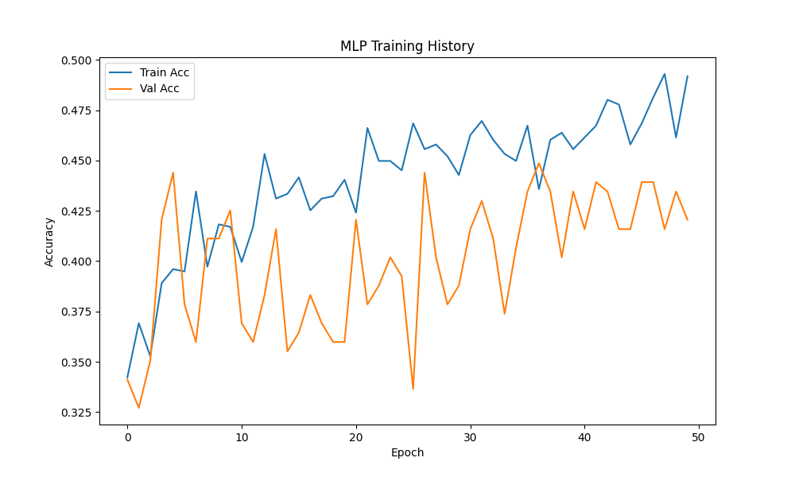
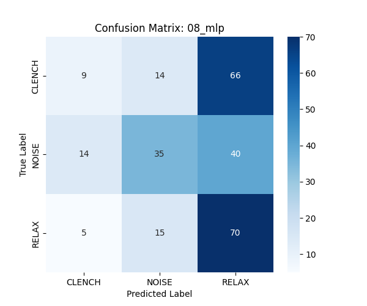

# Model 8: Multi-Layer Perceptron (MLP) Analysis

## 1. Abstract
The MLP represents our first foray into Deep Learning, treating the raw 1000-sample window as a flat vector. The goal was to learn features automatically (Set B), bypassing the manual feature engineering of Set A. This model failed to converge to a useful solution.

## 2. Quantitative Results
*   **Test Accuracy:** 42.54%
*   **F1-Score (Clench):** 0.00
*   **Inference Latency:** 1.09 ms

## 3. Mathematical Formulation (#MLMath)
The MLP computes a non-linear function composition. For layer $l$, the activation $a^{(l)}$ is:

$$
z^{(l)} = W^{(l)} a^{(l-1)} + b^{(l)}
$$

$$
a^{(l)} = \sigma(z^{(l)})
$$

Where:
*   $W^{(l)}$ is the weight matrix.
*   $\sigma$ is the activation function (ReLU: $\max(0, z)$).
*   The network attempts to minimize the Cross-Entropy Loss: $L = -\sum y \log(\hat{y})$.

## 4. Causal Mechanism (Lack of Inductive Bias)
Why did it fail? The MLP lacks the correct **Inductive Bias** for time-series data.
*   **Permutation Invariance:** If we shuffled the time points in our window randomly, the MLP could theoretically learn the same function. It doesn't "know" that $t$ and $t+1$ are related.
*   **Inefficiency:** It has to relearn the concept of a "spike" at every single position in the window, wasting parameters and data.

## 5. Technical Analysis
### 5.1. The "Small Data" Trap
Deep Learning models are "data hungry." We attempted to train a dense network (~100k parameters) on a dataset of only ~1300 samples.
*   **Result:** The model likely got stuck in a local minimum or overfitted to the noise in the training set, failing to generalize to the test set.
*   **Vanishing Gradients:** Without residual connections or batch normalization (omitted for simplicity/latency), the gradients may have vanished through the deep dense layers.

## 6. Visualization



## Confusion Matrix
```
[[ 9 14 66]
 [14 35 40]
 [ 5 15 70]]
```


