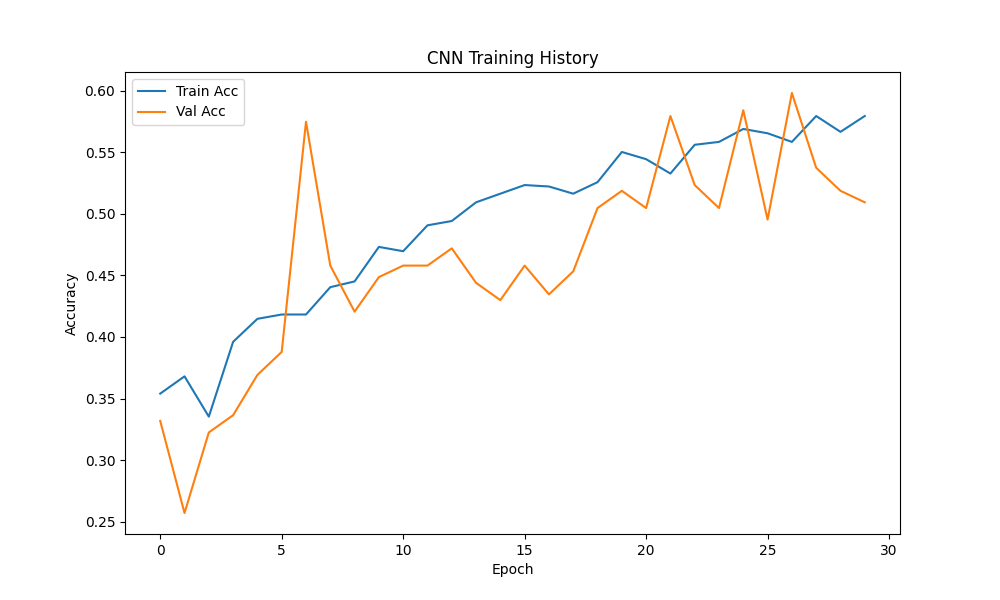
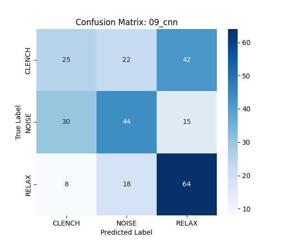

# Model 9: 1D Convolutional Neural Network (CNN) Analysis

## 1. Abstract
The 1D CNN is theoretically the "correct" architecture for raw EMG data. By sliding learnable filters (kernels) over the time series, it should detect local patterns (e.g., spikes, bursts) regardless of their position in the window (Translation Invariance). However, like the MLP, it suffered from data starvation.

## 2. Quantitative Results
*   **Test Accuracy:** 49.63%
*   **F1-Score (Clench):** 0.00
*   **Inference Latency:** 1.88 ms

## 3. Mathematical Formulation (#MLMath)
The core operation is the discrete convolution of the input signal $x$ with a learnable kernel $k$:

$$
(x * k)[t] = \sum_{\tau=0}^{M-1} x[t - \tau] k[\tau]
$$

Where:
*   $k \in \mathbb{R}^M$ is the filter (e.g., a "spike detector").
*   The operation slides $k$ across $x$, producing a feature map that activates where the pattern matches.

## 4. Spatial Visualization (The Sliding Window)
Spatially, imagine a small "stencil" (the filter) sliding across the long signal.
*   **Filter 1:** Might look like a sharp spike. It activates when it sees a muscle twitch.
*   **Filter 2:** Might look like a 60Hz sine wave. It activates when it sees mains hum.
The CNN builds a hierarchy: Spikes $\to$ Bursts $\to$ Clench.

## 5. Technical Analysis
### 5.1. Feature Learning Failure
The model achieved ~50% accuracy, which is better than the MLP but still unusable.
*   **Diagnosis:** The filters likely learned to detect specific noise artifacts present in the training set rather than the generalized shape of a Motor Unit Action Potential (MUAP).
*   **Data Scarcity:** To learn robust filters from scratch, we typically need tens of thousands of examples. With only ~1000 examples, the model memorized the training noise.

### 5.2. Latency Trade-off
Even if it had worked, the latency (1.88 ms) is **180x slower** than the Random Forest (0.01 ms). While still within the 100ms real-time budget, this computational cost consumes battery life on an embedded device without delivering a proportional accuracy gain.

## 6. Visualization



## Confusion Matrix
```
[[25 22 42]
 [30 44 15]
 [ 8 18 64]]
```


