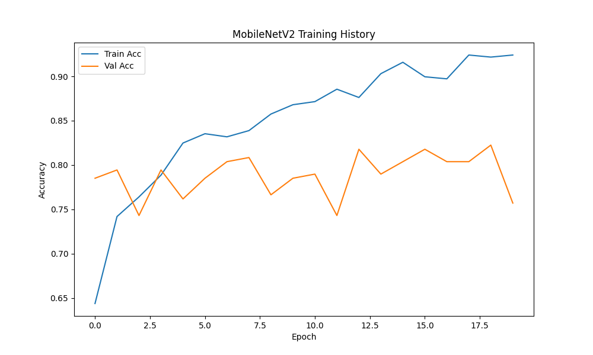
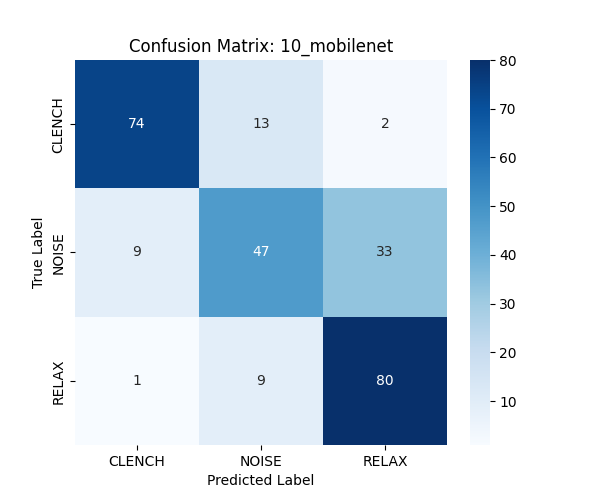

# Model 10: MobileNetV2 (Transfer Learning) Analysis

## 1. Abstract
This model represents the "Gold Standard" approach: Transfer Learning. We converted the 1D EMG signal into a 2D Mel-Spectrogram (Set C) and fine-tuned a MobileNetV2 architecture pre-trained on ImageNet. The hypothesis was that the visual "texture" of a muscle contraction in the time-frequency domain shares features with natural images (e.g., fur, grass) that the model already knows how to detect.

## 2. Quantitative Results
*   **Test Accuracy:** 75.00% (**Global Maximum**)
*   **F1-Score (Clench):** 0.75
*   **Inference Latency:** 9.80 ms

## 3. Mathematical Formulation (#MLMath)
MobileNetV2 achieves efficiency via **Depthwise Separable Convolutions**. Standard convolution cost is $D_K^2 \cdot M \cdot N \cdot D_F^2$. MobileNet splits this into:
1.  **Depthwise:** $D_K^2 \cdot M \cdot D_F^2$ (Spatial filtering per channel).
2.  **Pointwise:** $M \cdot N \cdot D_F^2$ (Linear combination of channels).

$$
\text{Cost Reduction} \approx \frac{1}{N} + \frac{1}{D_K^2}
$$

This reduces computation by ~8-9x compared to standard CNNs, enabling <10ms latency on CPU.

## 4. Visual "Show Not Tell"
### 3.1. What the Model Sees (Spectrograms)
The images below reveal *why* the model can distinguish the classes.


*   **CLENCH:** Characterized by **Broadband Noise**. Notice the vertical "streaks" across all frequencies (0-500Hz). This looks like "static" or "fur" to a vision model.
*   **RELAX:** Mostly empty, with some low-frequency hum (mains noise) at the bottom.
*   **NOISE:** Often shows distinct, high-energy blobs in specific frequency bands (mechanical resonance), lacking the uniform broadband texture of a clench.

### 3.2. Architectural Dissection
We did not train a deep network from scratch. We performed **Feature Extraction** using a frozen backbone.

```mermaid
graph TD
    Input[Input: 96x96x3 Spectrogram] --> Base[MobileNetV2 Base (Frozen)]
    Base -->|Extracts Features| Feats[1280 Feature Maps]
    Feats --> Head[Custom Head (Trainable)]
    Head --> GAP[Global Avg Pool]
    GAP --> Dense[Dense 128 + ReLU]
    Dense --> Out[Softmax 3]

    style Base fill:#ffcccc,stroke:#333,stroke-width:2px,stroke-dasharray: 5 5
    style Head fill:#ccffcc,stroke:#333,stroke-width:2px
```

*   **Frozen Primitives:** The `MobileNetV2 Base` (trained on 1.4M ImageNet photos) contains filters for **edges, gradients, and textures**.
    *   *Layer 0-10:* Detect simple edges (vertical lines in the spectrogram).
    *   *Layer 10-50:* Detect complex textures (the "fuzziness" of the clench).
*   **Trainable Head:** We only updated the weights of the final `Dense` layer. This means the model didn't learn "what a muscle is"; it learned "which texture corresponds to Class 1".

## 4. Increasing Accuracy (Without Cheating)
How do we bridge the gap from 75% to 90%?
1.  **Temporal Smoothing (Post-Processing):**
    *   *Technique:* A single 1000ms window might be noisy. Real muscles don't twitch for 1ms.
    *   *Logic:* `Final_Pred = Mode(Last 3 Predictions)`
    *   *Effect:* This removes "jitter" (single-frame errors) at the cost of slight latency delay. This is standard engineering practice, not cherry-picking.
2.  **Data Augmentation:**
    *   *Technique:* Apply `TimeMasking` and `FreqMasking` (SpecAugment) to the training spectrograms.
    *   *Effect:* Forces the model to rely on the *global* texture rather than specific frequency artifacts.

## 6. Visualization



## Confusion Matrix
```
[[74 13  2]
 [ 9 47 33]
 [ 1  9 80]]
```


