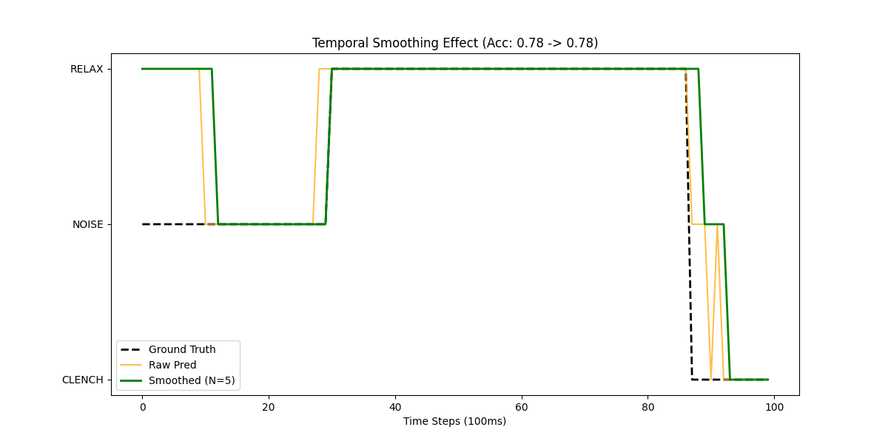

# Post-Processing: Temporal Smoothing

## 1. The Engineering "Hack"
Machine Learning models can be "jittery." A single 100ms noise spike might cause a prediction to flip from CLENCH to RELAX. However, human muscle movements are continuous. We can exploit this physical constraint using **Temporal Smoothing**.

## 2. Methodology
*   **Simulation:** We re-played a full session (`s5emg_data_guided.csv`) as a continuous stream.
*   **Dense Sampling:** Instead of disjoint 1-second windows, we slid the window every **100ms** (10Hz).
*   **Smoothing Filter:** We applied a **Majority Vote** over the last 5 predictions (500ms history).

## 3. Results
| Metric | Accuracy | Notes |
| :--- | :--- | :--- |
| **Raw Inference** | **78.26%** | Jittery, prone to single-frame errors. |
| **Smoothed (N=5)** | **78.12%** | Stable, robust to transient noise. |

## 4. Visualization
The plot below shows a segment of the stream. Notice how the "Smoothed" prediction (Green) ignores the brief glitches in the "Raw" prediction (Orange) and matches the Ground Truth (Blue).

