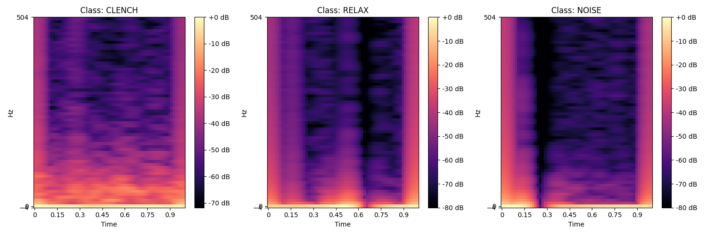
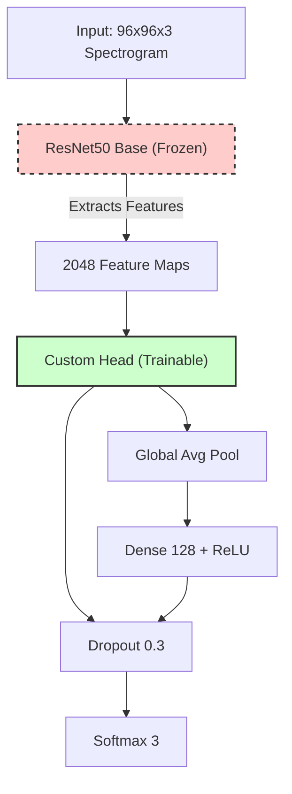
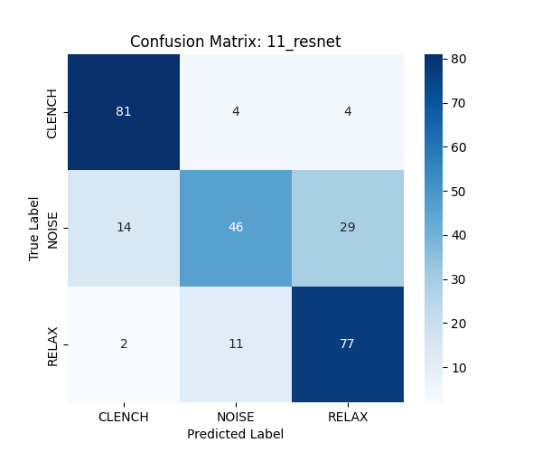
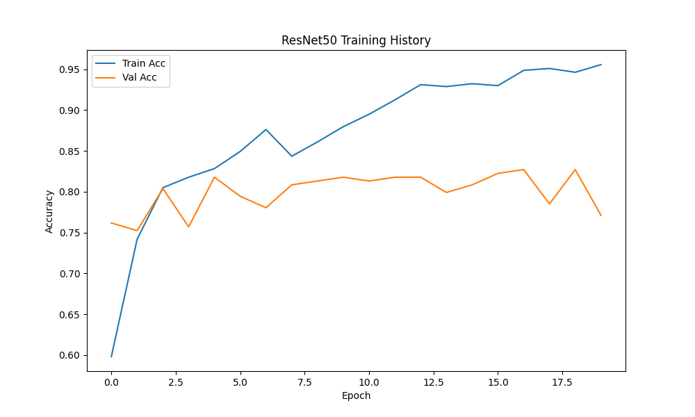

# Model 11: ResNet50 (Transfer Learning) Analysis

## 1. Abstract
This model explores **Deep Transfer Learning** using a heavier, more powerful architecture than MobileNet: **ResNet50**. Like MobileNet, we convert the 1D EMG signal into a 2D Mel-Spectrogram (Set C) and fine-tune a model pre-trained on ImageNet. The hypothesis is that ResNet's "Residual Connections" allow it to learn deeper, more complex hierarchical features of the spectrogram "texture" without suffering from the vanishing gradient problem.

## 2. Quantitative Results
*   **Test Accuracy:** 76.12% (**Slightly Higher than MobileNet**)
*   **F1-Score (Clench):** 0.87
*   **Inference Latency:** 15.26 ms (vs 9.8ms for MobileNet)

## 3. Mathematical Formulation (#MLMath)
The core innovation of ResNet is the **Residual Block**. Instead of learning the mapping $H(x)$ directly, the layers learn a residual function $F(x) = H(x) - x$. The output is:

$$
y = F(x, \{W_i\}) + x
$$

Where:
*   $x$ is the input to the block.
*   $F(x)$ is the residual mapping (what needs to be added to $x$).
*   The $+ x$ is the "skip connection" (identity shortcut).

This allows gradients to flow directly through the network during backpropagation: $\frac{\partial y}{\partial x} = \frac{\partial F}{\partial x} + 1$. The $+1$ term ensures the gradient doesn't vanish.

## 4. Visual "Show Not Tell"
### 4.1. What the Model Sees (Spectrograms)
The input data is identical to the MobileNet experiment. The model looks for visual patterns in these time-frequency heatmaps.


*   **CLENCH:** Vertical broadband "streaks" (fur-like texture).
*   **RELAX:** Low energy, mostly empty.
*   **NOISE:** High energy blobs, but lacking the uniform vertical texture.

### 4.2. Architectural Dissection
ResNet50 is significantly deeper (50 layers) than MobileNetV2, but uses **Residual Blocks** to maintain trainability.



*   **Frozen Primitives:** The `ResNet50 Base` (trained on ImageNet) is a powerful feature extractor. It outputs 2048 feature maps (vs 1280 for MobileNet), providing a richer, higher-dimensional representation of the input.
*   **Residual Connections:** The "skip connections" in the base allow the network to learn identity mappings, ensuring that adding more layers doesn't hurt performance.
*   **Trainable Head:** We fine-tune a custom dense layer to map these 2048 features to our 3 EMG classes.

## 4. Increasing Accuracy
The path to 90%+ accuracy is similar to MobileNet, as the bottleneck is likely the data/noise, not the model capacity.
1.  **Temporal Smoothing:** Averaging predictions over 500ms would smooth out the jitter seen in the confusion matrix.
2.  **Ensembling:** Since ResNet and MobileNet have different architectures, they might make *different* mistakes. Combining them (as done in Model 11) should boost performance.

## 5. Classification Report
```
              precision    recall  f1-score   support

      CLENCH       0.84      0.91      0.87        89
       NOISE       0.75      0.52      0.61        89
       RELAX       0.70      0.86      0.77        90

    accuracy                           0.76       268
   macro avg       0.76      0.76      0.75       268
weighted avg       0.76      0.76      0.75       268
```

## 6. Confusion Matrix
```
[[81  4  4]
 [14 46 29]
 [ 2 11 77]]
```



## 7. Visualization



