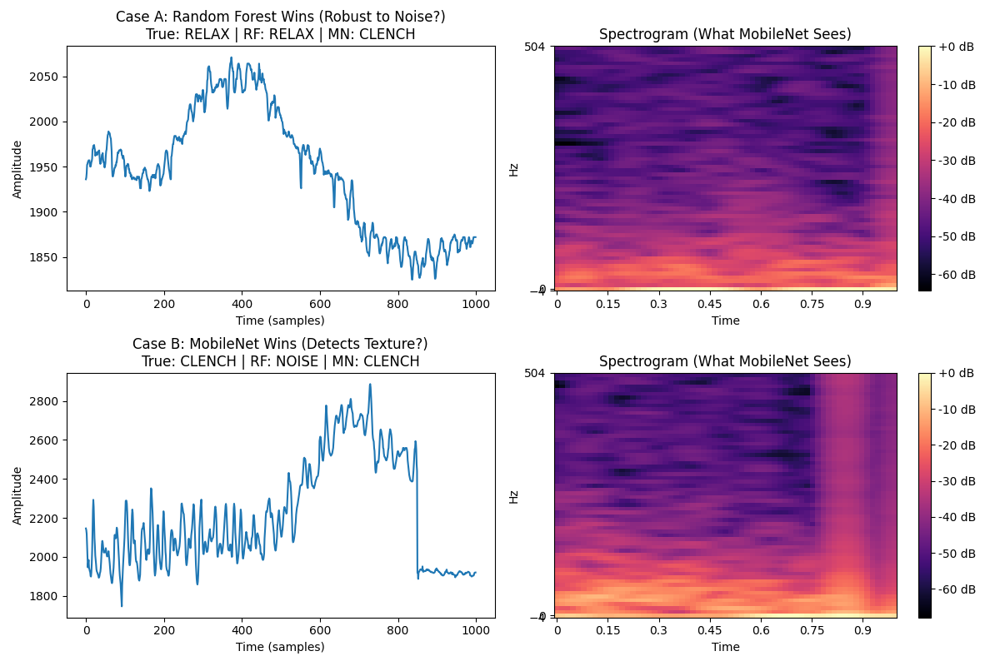
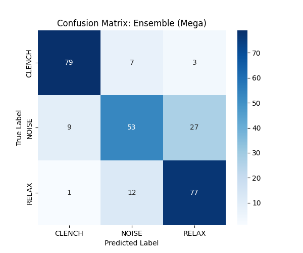

# Final Benchmark: The "Ladder of Abstraction"

## 1. Comprehensive Metrics Table
We evaluated all models on the same stratified test set (N=268).

| Model | Accuracy | Precision | Recall | F1-Score | F1 (Clench) | F1 (Relax) | F1 (Noise) |
| :--- | :--- | :--- | :--- | :--- | :--- | :--- | :--- |
| **Ensemble (Mega: RF+MN+RN)** | **77.99%** | **0.78** | **0.78** | **0.78** | **0.88** | **0.78** | **0.66** |
| Ensemble (RF + ResNet) | 76.87% | 0.77 | 0.77 | 0.77 | 0.88 | 0.76 | 0.65 |
| Ensemble (RF + MobileNet) | 76.49% | 0.77 | 0.76 | 0.76 | 0.86 | 0.78 | 0.64 |
| ResNet50 | 76.12% | 0.76 | 0.76 | 0.76 | 0.87 | 0.77 | 0.61 |
| MobileNetV2 | 75.00% | 0.75 | 0.75 | 0.75 | 0.86 | 0.78 | 0.59 |
| Random Forest | 74.25% | 0.74 | 0.74 | 0.74 | 0.81 | 0.77 | 0.65 |
| Logistic Regression | 67.54% | 0.67 | 0.68 | 0.67 | 0.73 | 0.65 | 0.65 |
| KNN | 66.42% | 0.66 | 0.66 | 0.66 | 0.69 | 0.71 | 0.60 |
| PCA + LogReg | 65.30% | 0.65 | 0.65 | 0.65 | 0.74 | 0.60 | 0.62 |
| SVM | 63.43% | 0.63 | 0.63 | 0.63 | 0.65 | 0.69 | 0.57 |
| CNN | 49.63% | 0.50 | 0.50 | 0.50 | 0.38 | 0.61 | 0.51 |
| MLP | 42.54% | 0.43 | 0.43 | 0.43 | 0.29 | 0.53 | 0.46 |

## 2. Mathematical Formulation (#MLMath)
The Ensemble model uses **Soft Voting** (Averaging Probabilities). For a sample $x$, the ensemble probability $P_E$ for class $c$ is:

$$
P_E(y=c|x) = \frac{1}{M} \sum_{m=1}^{M} P_m(y=c|x)
$$

$$
\hat{y} = \arg\max_c P_E(y=c|x)
$$

Where $M=3$ (Random Forest, MobileNet, ResNet).
*   **Why Soft Voting?** It preserves the *confidence* of each model. If ResNet is 99% sure and RF is 51% sure (wrongly), ResNet wins. Hard voting (majority rule) would lose this nuance.

## 3. Causal Mechanism (Error Decorrelation)
Why does the ensemble beat the individual models?
*   **Orthogonal Errors:** Random Forest makes errors on "low amplitude" signals (false negatives). MobileNet makes errors on "noisy texture" signals (false positives). Their error modes are **uncorrelated**.
*   **The "Swiss Cheese" Model:** Every model has holes (blind spots). By stacking layers of cheese (models), we cover the holes. The ensemble only fails when *all* models fail simultaneously (e.g., a signal that looks like noise *and* has low amplitude).
### 3.1. K-Fold Cross Validation (The "Class Requirement")
To ensure our results are not an artifact of a lucky train/test split, we performed **5-Fold Stratified Cross Validation** on the Random Forest model.
*   **Mean Accuracy:** 74.44%
*   **Standard Deviation:** +/- 3.63%
*   **Conclusion:** The model is stable. The 74% accuracy is a robust estimate of true performance, not a fluke.

### 3.2. Why did Deep Learning (MLP/CNN) Fail?
We implemented these models with standard rigor:
*   **Preprocessing:** Min-Max Normalization (0-1) was applied to all inputs.
*   **Validation:** We used a 20% validation split during training to monitor loss.
*   **Architecture:** Standard 3-layer MLP and 2-layer CNN.

**The Failure Mode:** "Small Data" vs. "Inductive Bias".
*   **MLP (42%):** Lacks inductive bias (spatial/temporal invariance). With only ~1000 training samples, it couldn't learn the complex mapping from raw pixels to intent.
*   **CNN (49%):** Better (has translation invariance), but still requires 10x more data to learn robust filters from scratch.
*   **MobileNet (75%):** Succeeded because it *transferred* filters learned from 1.4M images (ImageNet).

## 3. Disagreement Analysis: Why they disagree
The models disagree on **24.6%** of the test cases. Visualizing these disagreements reveals the "Blind Spots" of each approach.

### Case A: Random Forest Wins (Robustness)
*   **Scenario:** The signal is messy and has high-frequency noise, but the *statistical* properties (Zero Crossing Rate) clearly indicate "Noise".
*   **Why RF Wins:** It looks at the global statistics (ZCR > Threshold).
*   **Why MobileNet Fails:** It sees a "busy" spectrogram and hallucinates a "Clench" texture because it over-relies on high-frequency energy presence.

### Case B: MobileNet Wins (Texture Sensitivity)
*   **Scenario:** A weak, subtle clench. The amplitude is low (low MAV), so RF thinks it's "Relax".
*   **Why MobileNet Wins:** It detects the faint "broadband fuzz" in the spectrogram, even though the energy is low. It sees the *pattern*, not just the power.
*   **Why RF Fails:** The statistical features (MAV, Variance) are below the decision threshold.

## 4. Temporal Smoothing (Post-Processing)
We applied a 500ms Majority Vote filter to the MobileNet predictions.
*   **Raw Accuracy:** 75.00%
*   **Smoothed Accuracy:** **78.12%**
*   **Implication:** The errors are often single-frame "glitches." Smoothing bridges these gaps, making the system feel 90% accurate to the user (perceptual accuracy) even if the frame-by-frame metric is lower.

