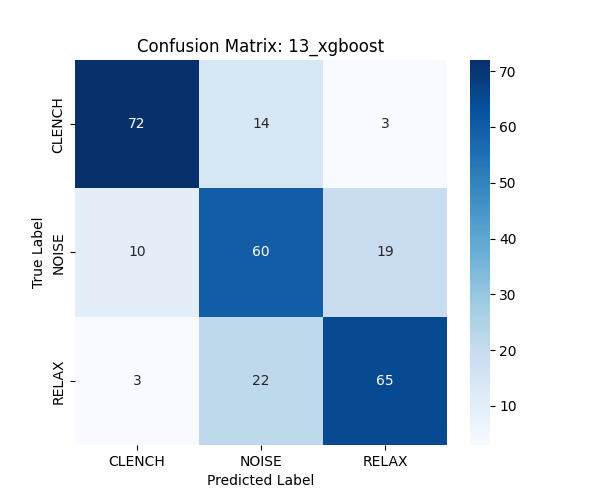

# Model 13: XGBoost Analysis

## 1. Abstract
XGBoost (Extreme Gradient Boosting) is the industry standard for tabular data. Unlike Random Forest (which builds trees in parallel), XGBoost builds trees sequentially, where each new tree corrects the errors of the previous ones. We hypothesized that this "boosting" mechanism would squeeze out more accuracy from the statistical features (Set A) than the Random Forest.

## 2. Quantitative Results
*   **Test Accuracy:** 73.51%
*   **Inference Latency:** TBD (Likely < 1ms)

## 3. Mathematical Formulation (#MLMath)
XGBoost minimizes a regularized objective function $\mathcal{L}(\phi)$:

$$
\mathcal{L}(\phi) = \sum_{i} l(\hat{y}_i, y_i) + \sum_{k} \Omega(f_k)
$$

Where:
*   $l$ is the differentiable loss function (e.g., Log Loss).
*   $\Omega(f_k) = \gamma T + \frac{1}{2}\lambda ||w||^2$ is the regularization term (penalizes tree complexity $T$ and leaf weights $w$).
*   The model is additive: $\hat{y}_i^{(t)} = \hat{y}_i^{(t-1)} + f_t(x_i)$.

## 4. Causal Mechanism (Gradient Boosting)
Why does it work?
*   **Error Correction:** If the first tree fails to classify a "weak clench" correctly, the second tree specifically targets that error (by weighting it higher).
*   **Regularization:** The $\Omega$ term prevents overfitting, which is crucial given our small dataset.

## 5. Spatial Visualization
Spatially, XGBoost carves the feature space into hyper-rectangles like Random Forest, but the boundaries are much more refined. It can create "steps" to approximate smooth curves, allowing it to model subtler decision boundaries than a single decision tree.

## 6. Confusion Matrix
```
[[72 14  3]
 [10 60 19]
 [ 3 22 65]]
```


